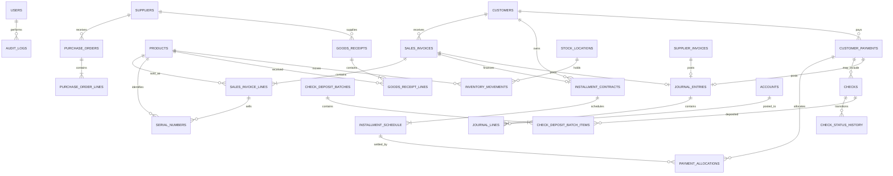
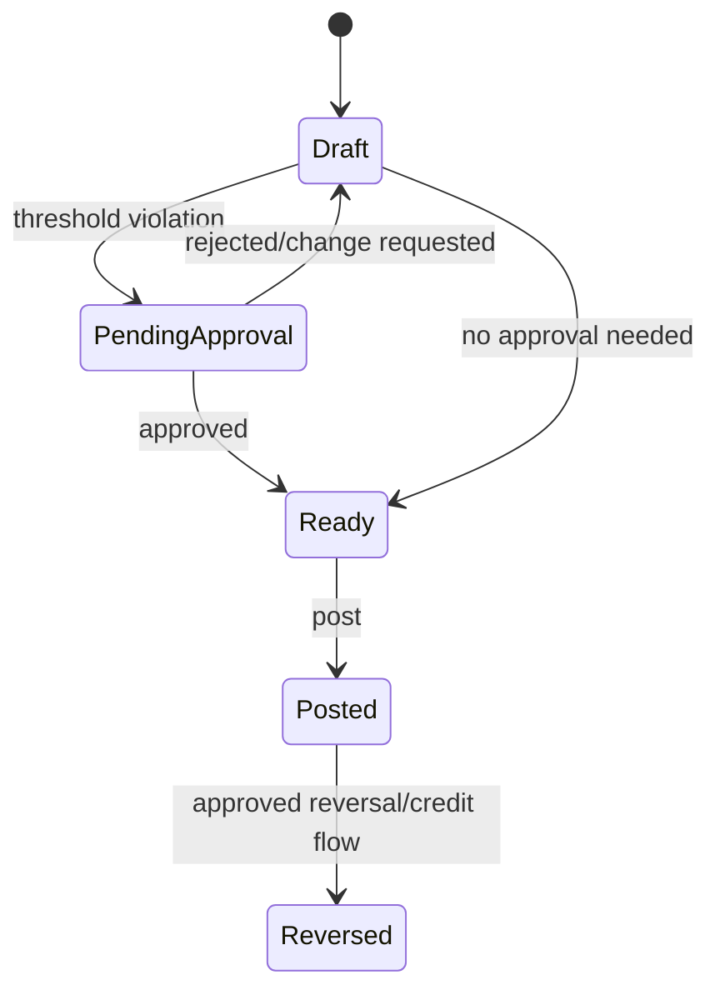
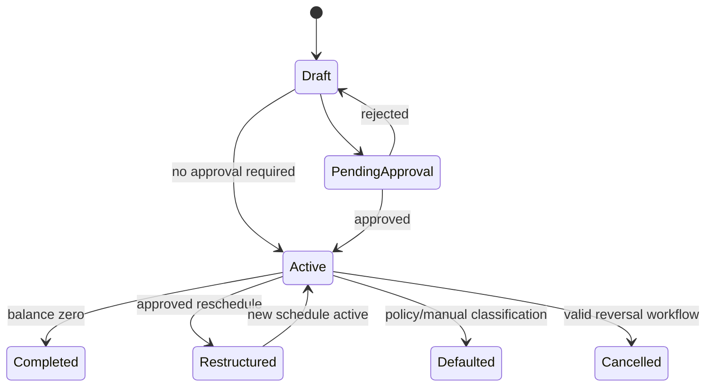
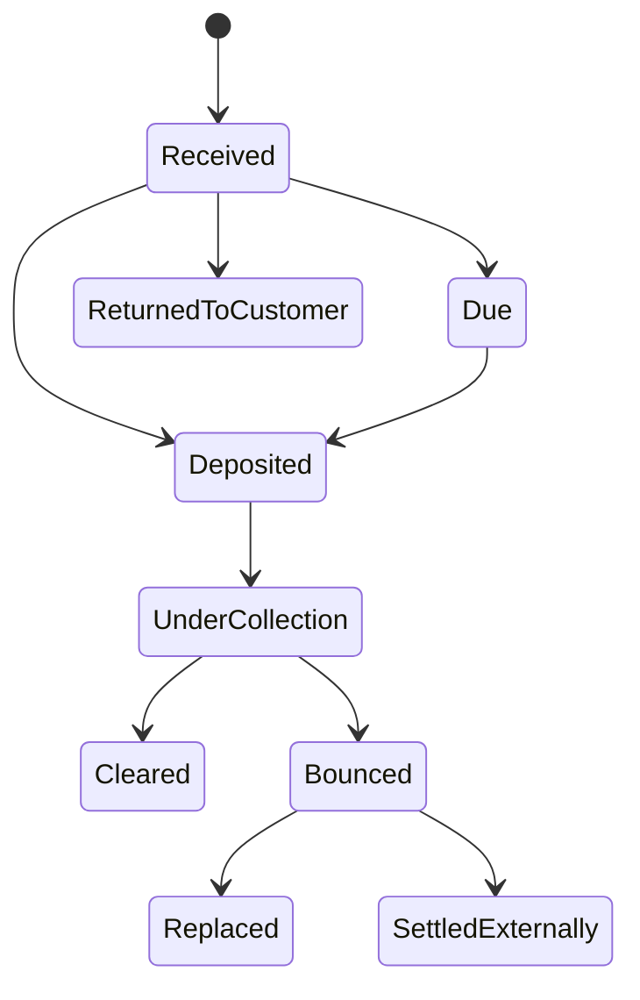
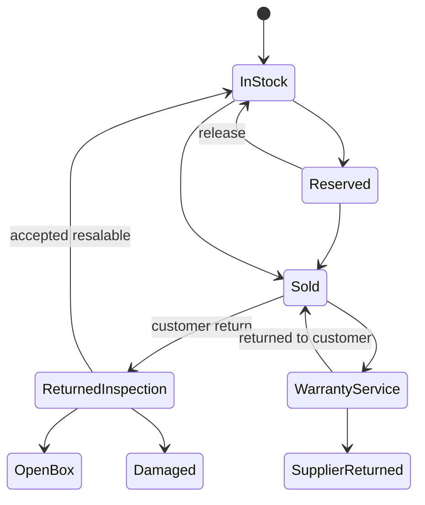

# ERD and State Diagrams

## 1. High-Level ERD

```mermaid
erDiagram
    USERS ||--o{ AUDIT_LOGS : performs
    CUSTOMERS ||--o{ SALES_INVOICES : receives
    SALES_INVOICES ||--|{ SALES_INVOICE_LINES : contains
    PRODUCTS ||--o{ SALES_INVOICE_LINES : sold_as
    PRODUCTS ||--o{ SERIAL_NUMBERS : identifies
    SALES_INVOICE_LINES ||--o{ SERIAL_NUMBERS : sells

    CUSTOMERS ||--o{ INSTALLMENT_CONTRACTS : owns
    SALES_INVOICES ||--o| INSTALLMENT_CONTRACTS : finances
    INSTALLMENT_CONTRACTS ||--|{ INSTALLMENT_SCHEDULE : schedules
    CUSTOMERS ||--o{ CUSTOMER_PAYMENTS : pays
    CUSTOMER_PAYMENTS ||--o{ PAYMENT_ALLOCATIONS : allocates
    INSTALLMENT_SCHEDULE ||--o{ PAYMENT_ALLOCATIONS : settled_by

    CUSTOMER_PAYMENTS ||--o{ CHECKS : may_include
    CHECKS ||--o{ CHECK_STATUS_HISTORY : transitions
    CHECK_DEPOSIT_BATCHES ||--|{ CHECK_DEPOSIT_BATCH_ITEMS : contains
    CHECKS ||--o{ CHECK_DEPOSIT_BATCH_ITEMS : deposited

    SUPPLIERS ||--o{ PURCHASE_ORDERS : receives
    PURCHASE_ORDERS ||--|{ PURCHASE_ORDER_LINES : contains
    SUPPLIERS ||--o{ GOODS_RECEIPTS : supplies
    GOODS_RECEIPTS ||--|{ GOODS_RECEIPT_LINES : contains
    PRODUCTS ||--o{ GOODS_RECEIPT_LINES : received

    PRODUCTS ||--o{ INVENTORY_MOVEMENTS : moves
    STOCK_LOCATIONS ||--o{ INVENTORY_MOVEMENTS : holds

    JOURNAL_ENTRIES ||--|{ JOURNAL_LINES : contains
    ACCOUNTS ||--o{ JOURNAL_LINES : posted_to
    SALES_INVOICES ||--o| JOURNAL_ENTRIES : posts
    CUSTOMER_PAYMENTS ||--o| JOURNAL_ENTRIES : posts
    SUPPLIER_INVOICES ||--o| JOURNAL_ENTRIES : posts
```

## 2. Sales Invoice State

```mermaid
stateDiagram-v2
    [*] --> Draft
    Draft --> PendingApproval: threshold violation
    PendingApproval --> Draft: rejected/change requested
    PendingApproval --> Ready: approved
    Draft --> Ready: no approval needed
    Ready --> Posted: post
    Posted --> Reversed: approved reversal/credit flow
```

## 3. Installment Contract State

```mermaid
stateDiagram-v2
    [*] --> Draft
    Draft --> PendingApproval
    Draft --> Active: no approval required
    PendingApproval --> Active: approved
    PendingApproval --> Draft: rejected
    Active --> Completed: balance zero
    Active --> Restructured: approved reschedule
    Restructured --> Active: new schedule active
    Active --> Defaulted: policy/manual classification
    Active --> Cancelled: valid reversal workflow
```

## 4. Check State

```mermaid
stateDiagram-v2
    [*] --> Received
    Received --> Due
    Received --> Deposited
    Due --> Deposited
    Deposited --> UnderCollection
    UnderCollection --> Cleared
    UnderCollection --> Bounced
    Bounced --> Replaced
    Bounced --> SettledExternally
    Received --> ReturnedToCustomer
```

## 5. Serial State

```mermaid
stateDiagram-v2
    [*] --> InStock
    InStock --> Reserved
    Reserved --> InStock: release
    Reserved --> Sold
    InStock --> Sold
    Sold --> ReturnedInspection: customer return
    ReturnedInspection --> InStock: accepted resalable
    ReturnedInspection --> OpenBox
    ReturnedInspection --> Damaged
    Sold --> WarrantyService
    WarrantyService --> Sold: returned to customer
    WarrantyService --> SupplierReturned
```
