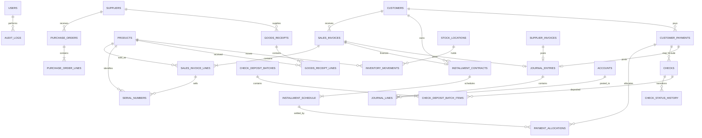
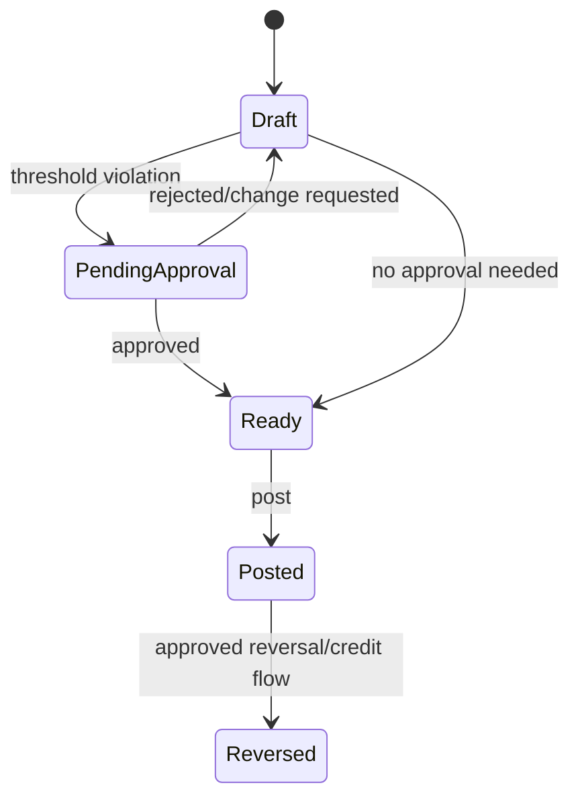
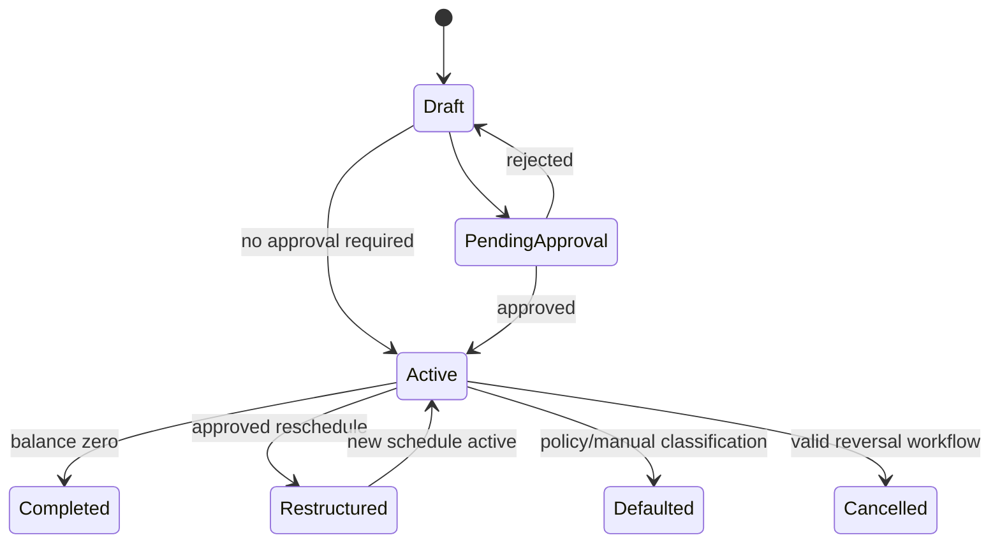
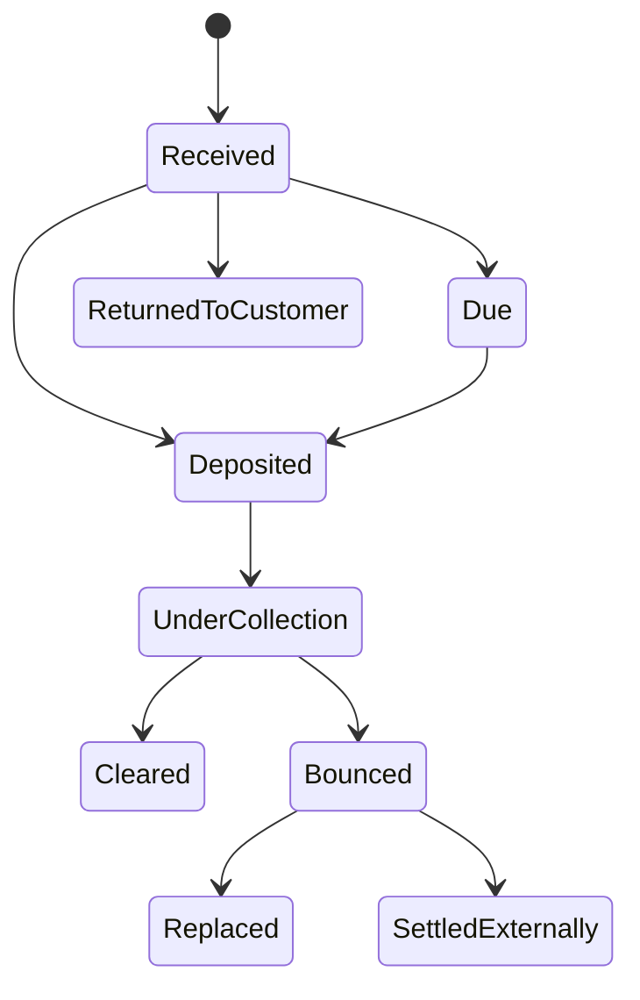
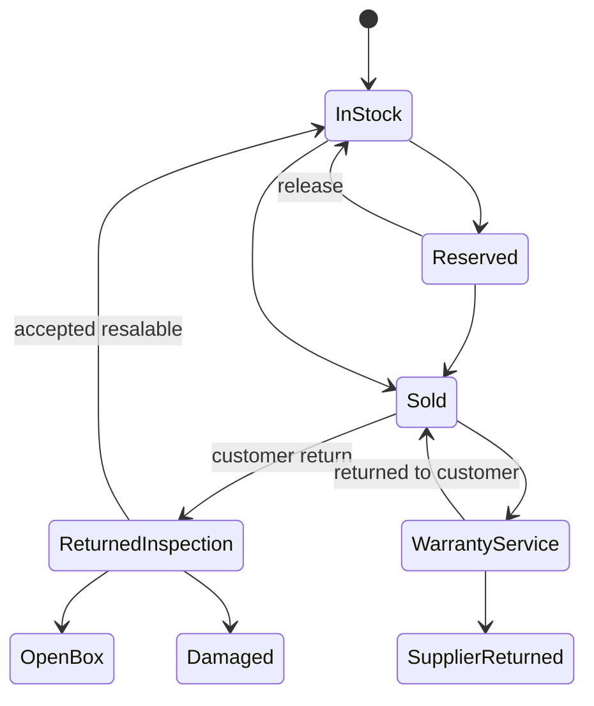

# ERP Master Documentation — Single-Store Home Electrical Appliances Shop (Palestine)

## 1. Purpose
This documentation defines a production-grade ERP for **one Palestinian retail shop selling home electrical appliances**. The system is intentionally designed as a **single-store ERP**, not multi-company and not multi-branch. It combines retail sales, serial-controlled inventory, suppliers and purchasing, installment sales, post-dated checks, customer receivables, Palestinian-oriented accounting/VAT, cash/bank management, warranty, returns, approvals, reporting, and auditability.

## 2. Mandatory Technology Stack
- Backend: **Laravel** (modular monolith, REST API).
- Database: **MySQL 8+**.
- Queue: **Laravel Queue using the database driver** stored in MySQL.
- Frontend: **React + TypeScript + Tailwind CSS**.
- API auth: Laravel Sanctum (SPA) or equivalent first-party Laravel token/session approach.
- File storage: local filesystem initially, with abstraction that permits later migration to S3-compatible storage without redesign.
- Scheduled tasks: Laravel Scheduler executed by OS cron / Windows Task Scheduler.

### Explicitly excluded
- Docker.
- Redis.
- PostgreSQL.
- Multi-company.
- Multi-branch.
- E-commerce storefront / customer online checkout.
- Manufacturing/MRP.
- Unrelated enterprise modules that do not serve this shop.

## 3. Design Principles
1. **Accounting is the source of financial truth.** Sales and payments post double-entry journals.
2. **Inventory is movement-ledger based.** Current quantity is derived/maintained from immutable stock movements, not arbitrary quantity edits.
3. **Installment is a receivable contract, not a payment method.** Cash/check/bank payments settle installments.
4. **A check is a financial instrument with a lifecycle**, not merely a string on a payment row.
5. **Physical appliances can be individually traceable** through serial numbers.
6. **Posted financial documents are never silently deleted.** They are reversed/cancelled with audit trail.
7. **Configuration over hard-coding** for VAT, accounts, document sequences, credit rules, installment policies, and fiscal settings.
8. **Owner control** through fine-grained permissions, approvals, audit logs, and period locking.
9. **Arabic-first capable UI**, with RTL support and English-ready data structures.
10. **Performance by design**, particularly for ledgers, receivables aging, inventory valuation, installments, checks, and VAT reports.

## 4. Primary Business Flow
```text
Account Created
  -> Store Setup Wizard
  -> Fiscal / Accounting Setup
  -> Categories & Brands
  -> Products / Models / Serial Tracking
  -> Suppliers
  -> Opening Stock & Opening Balances
  -> Ready for Operations

Purchasing -> Receiving -> Inventory -> Supplier Payable -> Supplier Payment

Inventory -> In-store Sale -> Cash OR Installment
                         -> Invoice -> Accounting Posting

Installment Contract -> Schedule -> Collection -> Cash / Check / Bank
Check -> Received -> Due -> Deposited -> Cleared OR Bounced
Bounced -> Customer Receivable Reinstated -> Follow-up / Replacement
```

## 5. Documentation Map
- `01_PRODUCT_REQUIREMENTS.md` — scope, actors, functional/non-functional requirements.
- `02_TECHNICAL_ARCHITECTURE.md` — backend/frontend architecture and domain boundaries.
- `03_STORE_SETUP_AND_MASTER_DATA.md` — first-use onboarding and master data.
- `04_DATABASE_DESIGN.md` — schema domains, tables, important fields and relationships.
- `05_ACCOUNTING_AND_PALESTINIAN_VAT.md` — double-entry model, tax rules, periods and controls.
- `06_INSTALLMENT_ENGINE.md` — contracts, schedules, payment allocation, rescheduling and defaults.
- `07_CHECK_MANAGEMENT.md` — post-dated checks, deposits, clearing, returns, replacement and controls.
- `08_INVENTORY_SERIALS_WARRANTY.md` — stock ledger, serial numbers, valuation, warranty and stock counts.
- `09_PURCHASING_AND_SUPPLIERS.md` — procurement and AP lifecycle.
- `10_SALES_POS_AND_RETURNS.md` — in-store sales, invoicing, discounts, returns and exchanges.
- `11_CUSTOMERS_AND_CREDIT_CONTROL.md` — customer files, limits, risk, aging and collection.
- `12_CASH_BANK_EXPENSES_AND_CLOSING.md` — cashboxes, banks, expenses and cashier sessions.
- `13_API_DESIGN.md` — API conventions and endpoint catalog.
- `14_UI_UX_INFORMATION_ARCHITECTURE.md` — menus, pages, UX and forms.
- `15_ROLES_PERMISSIONS_APPROVALS.md` — RBAC, approvals and sensitive operations.
- `16_REPORTING_AND_DASHBOARDS.md` — operational, accounting, VAT, installment and owner reports.
- `17_SECURITY_AUDIT_BACKUP.md` — application security, audit, backup and recovery.
- `18_PERFORMANCE_MYSQL_AND_QUEUE.md` — indexing, Laravel database queue, caching strategy without Redis.
- `19_NOTIFICATIONS_AND_SCHEDULER.md` — reminders and scheduled jobs.
- `20_DEPLOYMENT_NO_DOCKER.md` — traditional server deployment.
- `21_IMPLEMENTATION_PLAN.md` — phased build sequence.
- `22_ACCEPTANCE_CRITERIA.md` — release criteria and business acceptance.
- `23_ACCOUNTING_EXAMPLES.md` — realistic journal examples.
- `24_CODEX_IMPLEMENTATION_PROMPT.md` — a single implementation prompt for an AI coding agent.
- `25_LEGAL_AND_MARKET_REFERENCES.md` — authoritative references and legal assumptions.

## 6. Product Goal
The owner should be able to answer, at any moment:
- How much did the shop sell today/month/year?
- What is gross profit and net profit?
- What stock exists physically and what is its value?
- Which exact serialized appliance was sold to which customer?
- How much do customers owe the shop?
- Which installments are due/late?
- Which checks are due, deposited, cleared, or bounced?
- How much does the shop owe suppliers?
- How much cash and bank balance is represented in the ERP?
- What VAT is payable/recoverable for the current period?
- Which employees changed, cancelled, discounted or approved financial transactions?

## 7. MVP vs Full ERP
This documentation defines the **full target architecture**, but implementation is phased. The first production release must already be financially coherent: Store Setup, Catalog, Inventory, Purchasing, Sales, Customers, Installments, Checks, Core Accounting, Cash/Bank, VAT configuration, Roles, Audit, and essential reports. HR/payroll can follow after the financial core stabilizes.


---


# Product Requirements Document (PRD)

## 1. Product Definition
A single-store ERP for a Palestinian home electrical appliances retailer. All sales happen in the physical shop and are entered by authorized staff. The solution supports cash sales and installment sales, including installment collections by cash, check, or bank payment.

## 2. Actors
### Owner / Super Admin
Full control, financial visibility, approvals, configuration, period closing, user management and sensitive overrides.

### Accountant
Accounting, journal review/posting where allowed, VAT reports, bank/cash reconciliation, AP/AR, period close preparation and financial reports.

### Sales / Cashier
Create customer sales, receive allowed payments, print invoices/receipts, limited customer access. No unrestricted cost/profit access.

### Inventory / Purchasing User
Products, suppliers, purchase orders, receiving, stock transfers/adjustments subject to permissions.

### Collection User (optional role)
Installment follow-up, receipts and check status operations within restricted permissions.

## 3. Functional Scope
### A. Identity & Store Settings
- Pre-created platform/shop account.
- Login/logout/password reset.
- Optional MFA for owner/accountant.
- Store profile and legal/tax information.
- Fiscal year and accounting periods.
- Number sequences.
- Currency and exchange-rate configuration.

### B. Catalog
- Categories and nested categories.
- Brands.
- Units of measure.
- Product models/variants.
- SKUs, barcodes, specifications, images.
- Cash price, installment price, minimum allowed price.
- VAT category.
- Warranty policies.
- Serial tracking flags.

### C. Inventory
- Multiple internal stock locations in the single store context.
- Receiving, sale issue, customer return, supplier return, transfer, adjustment, damaged/open-box/warranty stock.
- Serial number lifecycle.
- Stock counts.
- Low/reorder stock alerts.
- Costing and stock valuation.

### D. Purchasing
- Suppliers.
- Purchase orders.
- Goods receipts.
- Supplier invoices.
- Supplier returns and credit notes.
- Supplier payments.
- AP aging.
- Payment proof attachments for policies/legal evidence where required.

### E. Sales / POS
- In-store order creation.
- Search by barcode/SKU/name/model/brand/serial.
- Customer selection or walk-in cash customer.
- Cash and installment sale modes.
- Discount controls.
- Invoice and receipt generation.
- Returns/exchanges and credit notes.

### F. Installments
- Down payment.
- Equal or custom schedule.
- Frequency: monthly by default, extensible to custom interval.
- Contract status and approval.
- Partial installment payment.
- Early settlement.
- Rescheduling with owner approval.
- Overdue tracking.
- Allocation of payments to installments.

### G. Checks
- Check instrument as a first-class entity.
- Post-dated checks per installment or as customer account settlement.
- Received, due, deposited, under collection, cleared, bounced, replaced, cancelled/returned.
- Check deposit batches.
- Return reasons and fees.
- Replacement check link.
- Customer check history and risk indicators.

### H. Accounting
- Double-entry general ledger.
- Configurable Chart of Accounts.
- Journals and journal entries.
- AR/AP subledgers.
- Inventory/COGS posting.
- Cash/bank/check accounts.
- VAT input/output.
- Expenses.
- Period locking and reversal model.

### I. Reports
Financial, VAT, sales, purchases, inventory, installment, checks, customers, suppliers, owner analytics and audit reports.

## 4. Non-Functional Requirements
- Correctness of accounting postings is more important than UI convenience.
- All monetary values use decimal columns; never floating point.
- Timezone defaults to Palestine and remains configurable.
- Arabic RTL UI supported throughout.
- API validation required server-side even if frontend validates.
- Long reports and exports use Laravel Queue with the database queue driver.
- All sensitive write workflows run in DB transactions.
- Every posted financial document has immutable identifiers and audit history.
- No destructive delete of posted financial records.
- MySQL foreign keys and purposeful indexes mandatory.
- Daily backups plus verified restoration process.

## 5. Out of Scope
- Online storefront.
- Multi-branch consolidation.
- Multi-company holding structure.
- Manufacturing/MRP.
- Fleet.
- Complex CRM pipeline.
- Project management.
- Docker/containers.
- Redis/PostgreSQL.

## 6. Success Metrics
- Inventory discrepancy reduced and traceable.
- Installment aging available in seconds.
- Check exposure by due date/status available immediately.
- Daily cashier closing reconciles system vs physical cash.
- VAT summary generated from posted transactions without spreadsheet reconstruction.
- Owner can trace every number in dashboards back to source transactions.


---


# Technical Architecture

## 1. Architecture Style
Use a **modular monolith** in Laravel. The system is one deployable backend with strong domain boundaries. This provides transactional integrity and simpler operations than microservices while keeping code organized enough for future extraction if ever needed.

## 2. Backend Stack
- PHP + Laravel.
- REST JSON API.
- MySQL 8+.
- Laravel Queue: `database` connection.
- Laravel Scheduler for recurring jobs.
- Laravel Sanctum for first-party SPA authentication.
- Policies/Gates plus custom permission middleware for authorization.
- Form Requests for validation.
- API Resources/DTOs for response contracts.
- Service/action classes for domain operations.
- DB transactions around all financial and stock posting operations.

## 3. Frontend Stack
- React.
- TypeScript with strict mode.
- Tailwind CSS.
- React Router.
- Query/data-fetching layer such as TanStack Query.
- Form handling with typed validation.
- RTL-aware layout from the first component.
- Reusable data table, filters, money input, date input, status badge, approval dialog and print layouts.

## 4. Domain Modules
Suggested backend structure:
```text
app/
  Domains/
    Identity/
    StoreSetup/
    Catalog/
    Inventory/
    Purchasing/
    Sales/
    Customers/
    Installments/
    Checks/
    Payments/
    Accounting/
    Tax/
    CashBank/
    Expenses/
    Warranty/
    Reporting/
    Approvals/
    Audit/
    Notifications/
```

Each domain may contain:
```text
Actions/
DTOs/
Enums/
Events/
Exceptions/
Jobs/
Models/
Policies/
Queries/
Repositories/   (only when abstraction is justified)
Services/
Support/
```

Avoid a giant `Services` directory with unrelated classes.

## 5. Posting Architecture
Operational documents should have state:
`draft -> approved(optional) -> posted -> reversed/cancelled`.

Posting uses dedicated actions such as:
- `PostSalesInvoiceAction`
- `PostPurchaseInvoiceAction`
- `ReceiveCustomerPaymentAction`
- `ClearCheckAction`
- `BounceCheckAction`
- `PostInventoryAdjustmentAction`

A posting action must:
1. lock/check source document state;
2. validate accounting configuration;
3. validate stock/serial rules where relevant;
4. open a MySQL transaction;
5. create inventory movements if applicable;
6. create payment/check transitions if applicable;
7. create balanced journal entry;
8. mark source as posted;
9. write audit metadata;
10. commit;
11. dispatch non-critical after-commit jobs such as notifications/export refreshes.

## 6. Queue Without Redis
Use:
```env
QUEUE_CONNECTION=database
```
Laravel standard queue tables are stored in MySQL. Use multiple queue names logically even with the same driver:
- `default`
- `reports`
- `exports`
- `notifications`
- `maintenance`

Run separate workers where beneficial:
```bash
php artisan queue:work database --queue=default --tries=3
php artisan queue:work database --queue=reports,exports --tries=2 --timeout=300
php artisan queue:work database --queue=notifications --tries=5
```
Managed by Supervisor/systemd on Linux or an equivalent process manager on Windows Server.

## 7. Transaction Boundaries
Never queue core financial posting itself unless the UI explicitly represents a pending state. Normal sale, payment, check receipt and posting should complete transactionally in the request. Queue heavy side effects only after commit.

## 8. File/Document Storage
Store invoice PDFs, receipts, check scans, payment proofs and attachments with metadata in DB and binary files on storage disk. Do not store large binaries in MySQL.

## 9. Idempotency
Critical APIs should support idempotency where duplicate submissions are dangerous: payment receipt, check state changes, invoice posting, return posting. Store request keys and resulting document IDs.

## 10. Error Strategy
Use domain exceptions with user-safe Arabic/English messages and machine-readable codes. Never expose SQL errors or stack traces to production users.


---


# Store Setup and Master Data

## 1. First Login Wizard
The account already exists before the owner enters the platform. On first login, the ERP detects incomplete setup and redirects to a guided wizard.

### Step 1 — Store Identity
- Trade/store name.
- Legal name if different.
- Owner/contact.
- Address.
- Phone/email.
- Logo.
- Tax registration fields.
- Default invoice footer and terms.

### Step 2 — Locale and Currency
- Base/accounting currency: ILS by default.
- Transaction currencies: ILS, USD, JOD initially.
- Timezone: Palestine.
- Date/number formatting.
- Arabic-first interface preference.

### Step 3 — Accounting Foundation
- Fiscal year start/end.
- Chart of Accounts template.
- Cashbox accounts.
- Bank accounts.
- Accounts Receivable control account.
- Accounts Payable control account.
- Inventory and COGS accounts.
- Sales/revenue accounts.
- VAT input/output/payable accounts.
- Post-dated checks / checks under collection accounts.

### Step 4 — Tax
- VAT registration status.
- Default VAT rate/configuration.
- Tax-inclusive vs tax-exclusive default price display.
- Invoice sequence.

### Step 5 — Catalog Masters
Owner creates categories, brands and attributes available in the shop.

### Step 6 — Suppliers and Products
Initial suppliers and product catalog.

### Step 7 — Opening Inventory
Opening stock by product/location/serial and opening cost.

### Step 8 — Opening Financial Balances
Optional migration of customer receivables, supplier payables, cash/bank and existing checks. Must be handled through controlled opening-balance journals, not ad-hoc edits.

## 2. Category Model
Supports parent-child hierarchy but avoid unnecessary depth. Example:
- Refrigerators
- Washing Machines
- TVs
- Air Conditioners
- Ovens
- Dishwashers
- Water Heaters
- Vacuum Cleaners
- Small Kitchen Appliances

## 3. Brand Model
Brand is independent from category. A brand can sell products across many categories.

## 4. Product Master
Important fields:
- internal SKU;
- barcode(s);
- product/model name Arabic/English;
- brand;
- category;
- manufacturer model number;
- serial tracking policy;
- warranty policy;
- tax code;
- unit of measure;
- purchase/standard cost references;
- cash selling price;
- installment selling price;
- minimum selling price;
- reorder level;
- active/discontinued state;
- specifications JSON or typed attribute values;
- dimensions/weight where useful;
- energy rating;
- country of origin;
- images/attachments.

## 5. Number Sequences
Configurable sequences for:
- sales invoices;
- sales returns/credit notes;
- receipts;
- payment vouchers;
- purchase orders;
- goods receipts;
- supplier invoices;
- supplier returns;
- journal entries;
- installment contracts;
- check deposit batches;
- stock adjustments;
- stock transfers;
- warranty claims.

Sequence generation must be atomic under concurrency.


---


# Database Design — MySQL

## 1. Rules
- MySQL 8+ / InnoDB.
- `utf8mb4` everywhere.
- Primary keys: BIGINT UNSIGNED unless UUID/ULID is strategically selected project-wide.
- Monetary fields: `DECIMAL(18,4)` or context-specific decimal; never FLOAT/DOUBLE.
- Exchange rates: `DECIMAL(18,8)`.
- Quantity: `DECIMAL(18,4)`.
- Use foreign keys for core integrity.
- Use soft deletes only for master data where historical references remain safe; do not soft-delete posted journals as a substitute for reversal.
- Add `created_by`, `updated_by` where business attribution matters; central audit log still required.

## 2. Identity / Configuration Tables
### users
`id, name, email, phone, password, status, last_login_at, mfa_enabled_at, timestamps`

### roles / permissions / model_has_roles / role_has_permissions
Fine-grained RBAC.

### store_settings
Single active store record or key/value settings table with typed schema.

### fiscal_years
`id, name, starts_on, ends_on, status`

### accounting_periods
`id, fiscal_year_id, period_no, starts_on, ends_on, status(open|soft_closed|locked), locked_at, locked_by`

### currencies
`code, name, decimal_places, is_active, is_base`

### exchange_rates
`id, currency_code, rate_date, rate_to_base, source, locked`

### document_sequences
`id, document_type, prefix, year_pattern, next_number, padding, reset_policy`

## 3. Catalog Tables
### categories
`id, parent_id, name_ar, name_en, slug, active, sort_order`

### brands
`id, name_ar, name_en, logo_path, active`

### products
Core product/model fields including pricing, tax category and tracking policy.

### product_barcodes
Multiple barcodes per product.

### product_attributes / attribute_values / product_attribute_values
Structured specifications.

### product_images
Image metadata.

### warranty_policies
`duration_value, duration_unit, provider_type, terms`

## 4. Inventory Tables
### stock_locations
Internal locations: showroom, main warehouse, damaged, returns, warranty, reserved.

### inventory_movements
Immutable movement ledger:
`id, product_id, location_id, direction, quantity, unit_cost, total_cost, movement_type, source_type, source_id, source_line_id, occurred_at, posted_at`

### inventory_balances
Optional maintained summary for fast reads:
`product_id, location_id, qty_on_hand, qty_reserved, qty_available, average_cost, updated_at`
Updated only through domain posting actions.

### serial_numbers
`id, product_id, serial_no, status, current_location_id, purchase_receipt_line_id, sold_sales_line_id, customer_id, warranty_start, warranty_end`
Unique index on normalized serial number according to business rule.

### serial_movements
History of each serial across receipts, transfers, sales, returns and warranty.

### stock_counts / stock_count_lines
Physical count and variance approval.

### stock_transfers / stock_transfer_lines
Movement between internal locations.

### stock_adjustments / stock_adjustment_lines
Controlled write-off/correction with approval threshold.

## 5. Supplier / Purchasing Tables
### suppliers
Identity, tax fields, currency, payment terms, credit limit, status.

### purchase_orders / purchase_order_lines
PO lifecycle.

### goods_receipts / goods_receipt_lines
Physical receipt. Serial capture occurs here for serialized products.

### supplier_invoices / supplier_invoice_lines
Financial invoice, VAT and due dates.

### supplier_credit_notes / lines
Returns/credits.

### supplier_payments
Payment header, currency, exchange rate, bank/cash account.

### supplier_payment_allocations
Maps payment to one or many supplier invoices.

## 6. Customer / Sales Tables
### customers
Identity/contact, national/business ID fields, address, credit policy, status, risk flag.

### customer_contacts
Optional multiple contacts.

### sales_orders / sales_order_lines
In-store transaction draft/approval/order state.

### sales_invoices / sales_invoice_lines
Posted tax/financial sales invoice.

### sales_returns / sales_return_lines
Customer return transaction.

### sales_credit_notes / lines
Financial adjustment.

## 7. Installment Tables
### installment_contracts
`id, contract_no, customer_id, sales_invoice_id, original_amount, down_payment, financed_amount, installment_markup, total_contract_amount, installment_count, frequency, first_due_date, status, approved_by, approved_at`

### installment_schedule
`id, contract_id, sequence_no, due_date, principal_amount, markup_amount, installment_amount, paid_amount, remaining_amount, status, settled_at`

### installment_reschedules
Old/new schedule snapshot, reason, requested_by, approved_by.

### payment_allocations
General mapping from customer payments to invoices/installments.

## 8. Payment / Check Tables
### customer_payments
`id, receipt_no, customer_id, payment_date, amount, currency, exchange_rate, method, cashbox_id, bank_account_id, status, posted_journal_entry_id`

### checks
`id, check_no, customer_id, payer_name, bank_id, bank_branch_text, amount, currency, issue_date, due_date, received_date, status, source_payment_id, deposited_at, cleared_at, bounced_at, return_reason_id, replacement_check_id`

### check_allocations
A check can be allocated to one or more installment/invoice obligations when policy permits.

### check_status_history
Every state transition with user, timestamp and note.

### check_deposit_batches / check_deposit_batch_items
Group checks deposited to a bank account.

### check_return_reasons
Configurable reference list.

## 9. Accounting Tables
### accounts
Chart of Accounts:
`id, code, name_ar, name_en, parent_id, account_type, normal_balance, is_control_account, allow_manual_posting, active`

### journals
Sales, Purchases, Cash Receipts, Cash Payments, Bank, General, Inventory, Checks, Opening.

### journal_entries
`id, entry_no, journal_id, entry_date, fiscal_period_id, reference_type, reference_id, description, status, posted_by, posted_at, reversal_of_id`

### journal_lines
`journal_entry_id, account_id, customer_id nullable, supplier_id nullable, debit, credit, currency, foreign_amount, exchange_rate, memo`
Constraint in service layer: total debit == total credit.

### tax_codes
Rate/effective dates and posting accounts.

### tax_transactions
Detailed VAT basis per source line for audit/reporting.

## 10. Cash / Bank / Expenses
### cashboxes
Cashbox/account link.

### bank_accounts
Bank identity, IBAN/account no if applicable, currency, GL account.

### cashier_sessions
Opening/closing balance and variance.

### expenses / expense_lines
Expense voucher, category/account, tax, payee, attachments.

## 11. Warranty
### warranty_claims
Customer/serial/problem/status/vendor/repair data.

### warranty_claim_events
Timeline.

## 12. Workflow / Governance
### approvals
Generic approval request linked to source document/action.

### approval_steps
Who approved/rejected and reason.

### audit_logs
`actor_user_id, action, entity_type, entity_id, before_json, after_json, ip_address, user_agent, occurred_at`
Sensitive fields should be masked where necessary.

### attachments
Generic file metadata.

### idempotency_keys
Protect critical repeated writes.

## 13. Queue/Scheduler Tables
Laravel queue tables:
- `jobs`
- `job_batches` if batching used
- `failed_jobs`

Application scheduler logs optional:
- `scheduled_task_runs`

## 14. Critical Indexes
At minimum:
- invoice/document numbers unique;
- `inventory_movements(product_id, location_id, occurred_at)`;
- `serial_numbers(serial_no)` unique/normalized;
- `installment_schedule(status, due_date)`;
- `checks(status, due_date)`;
- `journal_entries(entry_date, status)`;
- `journal_lines(account_id, journal_entry_id)`;
- `customer_payments(customer_id, payment_date)`;
- `sales_invoices(customer_id, invoice_date, status)`;
- `supplier_invoices(supplier_id, invoice_date, status)`;
- audit entity composite index;
- queue `jobs(queue, reserved_at, available_at)` compatible with Laravel schema.

## 15. Concurrency Locks
Use `SELECT ... FOR UPDATE` / Eloquent `lockForUpdate()` when generating sequences, posting stock affecting limited serials, allocating payments, or moving check state where a double transition could occur.


---


# Accounting and Palestinian VAT

> This specification is a software design based on currently available Palestinian legal/financial references. Before production go-live, the shop's licensed accountant/CPA should review the configured Chart of Accounts, invoice fields, VAT treatment and reporting mappings.

## 1. Accounting Model
Accrual-oriented double-entry accounting with integrated operational subledgers.

### Core ledgers
- General Ledger.
- Accounts Receivable.
- Accounts Payable.
- Inventory/COGS.
- Cash.
- Banks.
- Post-dated checks / checks under collection.
- VAT input/output/payable.
- Expenses/assets/equity.

## 2. Suggested Chart of Accounts Skeleton
### Assets
- Cash on Hand
- Bank Accounts
- Checks Receivable / Post-Dated Checks
- Checks Under Collection
- Accounts Receivable — Customers
- Inventory
- Prepaid Expenses
- Fixed Assets
- Accumulated Depreciation (contra)

### Liabilities
- Accounts Payable — Suppliers
- VAT Payable / Output VAT
- Other Payables
- Accrued Expenses

### Equity
- Owner Capital
- Owner Drawings
- Retained Earnings

### Revenue
- Appliance Sales
- Other Operating Revenue
- Installment-related revenue/markup account according to approved accounting policy
- Sales Returns/Allowances (contra)

### Cost / Expenses
- Cost of Goods Sold
- Rent
- Electricity
- Salaries
- Transportation
- Maintenance
- Bank Fees
- Returned Check Fees
- Marketing
- Depreciation
- Other Operating Expenses

## 3. VAT Configuration
The platform must use a tax-code table with effective dates rather than a hard-coded percentage. The current Palestinian VAT law and later amendments must be represented by configuration that can be changed prospectively without altering old posted transactions.

Each invoice line stores:
- tax code;
- taxable base;
- rate actually applied;
- tax amount;
- tax inclusive/exclusive flag;
- tax transaction record.

Historic invoices must never recalculate when the current configured rate changes.

## 4. VAT Registers
- Output VAT register (sales).
- Input VAT register (purchases/eligible expenses).
- Credit/debit note adjustments.
- Exempt/zero-rated tracking where applicable.
- Period summary.
- Source-document drilldown.

## 5. Period Closing
Statuses:
- Open: normal posting.
- Soft Closed: ordinary staff cannot post; accountant/owner may reopen with reason.
- Locked: no alteration of posted entries; corrections occur in a later open period using reversal/adjustment.

## 6. Currency
Base/accounting/tax presentation currency should default to ILS. Transactions may occur in ILS/USD/JOD.

Store on every foreign currency posting:
- transaction currency;
- foreign amount;
- exchange rate;
- base currency amount;
- source/date of rate where policy requires.

Do not overwrite old rates.

## 7. Document Integrity
Posted invoices and entries:
- cannot be hard-deleted;
- cannot have financial fields silently edited;
- corrections use credit note, reversal or approved adjustment;
- document number remains permanent;
- audit trail records cancellation/reversal reason.

## 8. Sales Recognition
When goods are delivered/sold, recognize sale and output VAT according to configured policy. Installment collection timing must not be used to postpone the original sale posting merely because cash will be collected later.

## 9. Inventory Accounting
Perpetual inventory recommended:
- Sale posts COGS and reduces Inventory.
- Purchase/receipt/invoice flow posts Inventory and AP according to receiving/invoice matching policy.
- Return reverses appropriate portion.

Preferred valuation for this store: **moving weighted average** unless accountant/business chooses FIFO. Serialized units preserve unit acquisition cost for traceability even when GL uses selected valuation policy.

## 10. Manual Journals
Allowed only to authorized accounting roles. Control accounts (AR, AP, Inventory, VAT, checks) should normally reject manual lines unless explicitly approved, preventing subledger/GL divergence.

## 11. Reconciliation
Required periodic reconciliations:
- AR subledger vs GL control account.
- AP subledger vs GL.
- Inventory valuation vs Inventory GL.
- Cashbox session vs Cash GL.
- Bank statement vs Bank GL.
- Check register vs check GL accounts.
- VAT transaction register vs VAT GL.

## 12. Records Retention
Design for at least seven years of financial/audit document retention to remain conservative across applicable bookkeeping/tax record requirements. Deletion policies must exclude records under legal/financial retention.


---


# Installment Engine

## 1. Core Concept
An installment contract is a receivable agreement created from a posted/approved sale. **Installment is not a payment method**. Payments are separate and are allocated to the contract schedule.

## 2. Contract Inputs
- Customer.
- Sales invoice/order.
- Cash price.
- Installment price.
- Installment markup/difference.
- Down payment.
- Financed amount.
- Number of installments.
- Frequency.
- First due date.
- Schedule generation rule.
- Rounding rule.
- Grace days.
- Notes/terms.
- Required approval when policy thresholds are exceeded.

## 3. Schedule Types
### Equal Installments
System divides financed amount according to count and places rounding difference in final installment.

### Custom Schedule
Authorized user can set non-equal installment amounts/dates before approval.

### Balloon/Final Payment
Larger last installment supported.

## 4. Contract States
`draft -> pending_approval -> active -> completed`
Additional exceptional states:
`cancelled, defaulted, restructured`.

## 5. Schedule Item States
- Upcoming.
- Due.
- Partially Paid.
- Paid.
- Overdue.
- Rescheduled/Voided (historical trace retained).

Status should be derived from due date + remaining amount wherever possible, not manually toggled.

## 6. Payment Allocation
A customer payment can be allocated to:
1. selected installment(s), or
2. oldest due first by policy.

Store explicit allocation records. Never infer allocation later from totals.

### Partial payment
If installment is 500 ILS and customer pays 300:
- paid_amount = 300;
- remaining = 200;
- status = Partially Paid / Overdue depending on date.

## 7. Down Payment
Down payment is a normal customer payment posted on sale/contract activation and allocated against the customer receivable. It must have a receipt and payment method.

## 8. Early Settlement
System calculates:
- outstanding receivable;
- any approved discount/rebate for early settlement;
- resulting adjustment/credit note if required by accounting policy;
- owner approval when discount exceeds threshold.

## 9. Rescheduling
Never overwrite the old schedule.
Process:
1. capture reason;
2. store original schedule snapshot/version;
3. request approval;
4. create new schedule version;
5. preserve already-paid allocations;
6. link old schedule rows to replacement rows or mark superseded;
7. audit all changes.

## 10. Overdue Logic
Nightly scheduler updates/derives aging buckets and reminders:
- 1–7 days;
- 8–30 days;
- 31–60 days;
- 61–90 days;
- 90+ days.

Do not mutate accounting merely because an installment became overdue; this is collection/risk state.

## 11. Customer Credit Policy
Before activating a new contract evaluate:
- current AR;
- active installment financed balance;
- overdue balance;
- bounced check count/value;
- configured credit limit;
- maximum active plans;
- minimum down-payment policy;
- manual risk flag.

Result can be:
- allowed;
- warning requiring approval;
- blocked except owner override.

## 12. Printing
Installment contract printout should include customer, invoice, financed total, down payment, schedule, payment terms, signatures and identifiers. Keep print template configurable and legal text reviewed by the shop's legal/accounting advisor.


---


# Check Management

## 1. Purpose
Checks are common settlement instruments and must be managed as financial assets with clear due dates, custody and collection states.

## 2. Check Capture
Fields:
- check number;
- payer/account holder;
- customer;
- bank;
- branch text/code if needed;
- currency;
- amount;
- issue date;
- due date;
- received date;
- image/scan attachment;
- related receipt;
- related installment/invoice allocations;
- notes.

Validate duplicate check number using a business-aware composite key (bank/account holder or other identifiers when available); do not assume check number alone is globally unique.

## 3. Lifecycle
Recommended state machine:
```text
Received/Post-Dated
   -> Due
   -> Deposited
   -> Under Collection
      -> Cleared
      -> Bounced

Bounced -> Replaced (new linked check)
Bounced -> Settled by cash/bank
Received -> Returned to Customer / Cancelled (with approval)
```

Every transition writes `check_status_history`.

## 4. Accounting Lifecycle (Configurable Accounts)
Example policy:
- Upon accepted check: Dr Post-Dated Checks Receivable / Cr Customer AR.
- On deposit: Dr Checks Under Collection / Cr Post-Dated Checks Receivable.
- On clearing: Dr Bank / Cr Checks Under Collection.
- On bounce: Dr Customer AR / Cr Checks Under Collection, plus approved bank fee handling.

Some accountants may choose a different moment to credit AR. Therefore account mappings and policy must be configurable, but the lifecycle/events remain explicit.

## 5. Bounced Check
Capture:
- bounce date;
- return reason;
- bank fee;
- PMA-related classification note if manually known;
- follow-up owner/user;
- settlement deadline/status;
- replacement check if any.

The original bounced check remains historical even after replacement.

## 6. Deposit Batches
User selects due/eligible checks and creates a bank deposit batch. Batch shows:
- bank account;
- deposit date;
- list of checks;
- total by currency;
- status;
- proof/attachment.

## 7. Dashboards
- checks due today;
- due within 7/30 days;
- held by currency;
- deposited/under collection;
- bounced;
- bounced by customer;
- checks awaiting replacement;
- expected future cash-flow from checks.

## 8. Controls
- Only privileged roles can mark check cleared/bounced manually.
- Clearing/bounce is idempotent.
- Cannot clear a cancelled/bounced check.
- Cannot delete a check tied to posted receipt.
- Amount cannot be changed after financial posting; correction uses reversal/reissue flow.
- Due date change after receipt requires permission/audit and may require approval.


---


# Inventory, Serial Tracking and Warranty

## 1. Inventory Model
Use a perpetual stock movement ledger. Never let normal screens directly edit `products.quantity`.

Movement types:
- opening balance;
- purchase receipt;
- purchase return;
- sale issue;
- sales return;
- internal transfer;
- adjustment gain/loss;
- damaged write-off;
- warranty movement;
- reservation/release where reservation design affects availability.

## 2. Internal Locations
Single store can still have multiple locations:
- Showroom.
- Main Warehouse.
- Reserved for Customer.
- Returns Inspection.
- Damaged/Open Box.
- Warranty/Service.

They are **not branches** and do not require branch accounting.

## 3. Serial Tracking
Serialized appliance flow:
1. purchase receiving creates/registers serial;
2. serial is assigned to a stock location;
3. internal transfers update serial location/history;
4. sale line must select exact available serial;
5. sale links serial to customer and invoice;
6. return updates state and inspection disposition;
7. warranty claim references exact serial.

Serial statuses:
`in_stock, reserved, sold, returned_pending_inspection, damaged, warranty_service, supplier_returned, retired`.

## 4. Negative Stock
Default: prohibited. Owner may optionally enable controlled negative stock for non-serialized consumables, but serialized products can never be sold without an actual available serial.

## 5. Costing
Recommended default: moving weighted average for general stock valuation. Serialized record keeps actual receipt/unit cost for margin traceability. Document the chosen GL valuation policy and keep it consistent.

## 6. Stock Count
Cycle/full stock count:
- freeze or snapshot expected quantity;
- count physical items;
- scan serials;
- identify missing/unexpected serials;
- calculate variance value;
- require approval above threshold;
- post adjustment movement and accounting entry.

## 7. Reorder
Product fields:
- minimum level;
- reorder point;
- preferred supplier;
- lead-time days.

Report suggests purchase quantities but does not auto-purchase without approval.

## 8. Warranty
Warranty can be:
- store-provided;
- supplier/manufacturer-provided.

At sale, compute start/end date based on policy and preserve it on serial/customer sale record even if product policy later changes.

Warranty claim lifecycle:
`opened -> inspected -> sent_to_supplier/service -> repaired/replaced/rejected -> returned_to_customer -> closed`.

## 9. Returns Disposition
Returned serialized appliance must be inspected and classified:
- resalable unopened;
- open-box/resalable with new price;
- damaged;
- warranty/service;
- return to supplier.

Do not automatically return every customer return to sellable stock.


---


# Purchasing and Suppliers

## 1. Supplier Master
Fields include legal/trade name, tax ID, contacts, address, currency, payment terms, credit limit, bank info where needed, active status and notes.

## 2. Procurement Flow
```text
Purchase Order (optional but recommended)
 -> Approval if threshold exceeded
 -> Goods Receipt
 -> Supplier Invoice
 -> 2/3-way matching checks
 -> Accounts Payable
 -> Supplier Payment
```

Small-shop mode may permit direct Goods Receipt + Supplier Invoice without a PO, subject to permission.

## 3. Goods Receipt
Receiving user verifies:
- product/model;
- quantity;
- serial numbers;
- damage/condition;
- actual receiving location;
- supplier delivery reference.

## 4. Supplier Invoice
Capture:
- invoice number;
- invoice date;
- due date;
- supplier;
- currency/rate;
- taxable base;
- VAT;
- total;
- attachments;
- related receipts/PO.

Prevent accidental duplicate supplier invoice numbers per supplier.

## 5. Accounts Payable
Supplier statement:
- opening balance;
- invoices;
- credit notes;
- payments;
- allocations;
- outstanding balance;
- aging.

## 6. Supplier Payment
Payment methods: cash, bank, check where business supports issuing checks. User selects invoices or allows oldest-first allocation. Payment posts GL and closes AP amounts.

## 7. Purchase Return
Reference original receipt/invoice where possible. Select exact serialized units. Inventory, supplier payable/credit and VAT must be adjusted through controlled posting.

## 8. Landed Cost
Optional but designed into target:
- transportation;
- shipping;
- customs/import charges;
- handling;
- other directly attributable cost.

Allocation bases: quantity, value, weight, manual. Result changes inventory unit cost only through an auditable landed-cost document.

## 9. Controls
- purchase price variance warning;
- approval for high-value PO;
- duplicate invoice detection;
- mandatory attachment/payment proof when policy requires;
- restricted backdating into closed periods.


---


# Sales, POS and Returns

## 1. Sales Context
All customer sales are created inside the shop by staff. No public e-commerce checkout is part of this ERP.

## 2. POS/Sales Screen Goals
Fast keyboard/barcode workflow with:
- search by barcode, SKU, model, Arabic/English name, brand;
- product cards/list with stock availability;
- serial selection for serialized product;
- customer selector;
- clear cash vs installment sale mode;
- totals, discounts and tax breakdown;
- permission-aware price override.

## 3. Walk-in Customer
Cash sale can use a configured walk-in customer when customer-specific identity is not required. Installment sales require a real customer profile and credit validation.

## 4. Sale States
`draft -> pending_approval(optional) -> confirmed/posted -> fulfilled`
Exceptional: `cancelled/reversed` through controlled flow.

## 5. Price Controls
Each product may have:
- cash list price;
- installment list price;
- minimum price;
- promotion/price list in future.

If price < minimum or discount > user's limit, create approval request.

## 6. Cash Sale
On completion:
- validate stock and exact serials;
- create/post sales invoice;
- record customer payment;
- create receipt if needed;
- reduce stock;
- post revenue/VAT/COGS/cash accounting.

## 7. Installment Sale
- real customer required;
- calculate cash price vs installment total;
- collect down payment if configured;
- create contract/schedule;
- validate credit policy;
- post sale and AR;
- print invoice + installment agreement/schedule.

## 8. Delivery/Fulfilment
If the shop delivers appliances later, sales invoice/order can track fulfilment status and reserved serial without becoming an e-commerce system. Optional fields: delivery address, delivery date, delivery fee, installer notes.

## 9. Sales Return
Return should reference original invoice when possible. Validate exact serial, return window and item condition. Result may create:
- credit/refund;
- exchange credit;
- reduction of customer AR;
- stock return to inspection location;
- VAT and COGS reversal according to original sale.

## 10. Exchange
Implement as return/credit plus new sale, linked for usability. Do not create opaque inventory swaps that bypass accounting.

## 11. Printing
Print templates:
- sales invoice;
- receipt;
- installment agreement/schedule;
- return/credit note;
- delivery slip if enabled.


---


# Customers and Credit Control

## 1. Customer Profile
For installment customers capture enough data for collection and risk control:
- full name / business name;
- ID/tax number fields as relevant;
- phones;
- address;
- workplace/employer optional;
- contact person/guarantor fields only if business chooses and legal/privacy review permits;
- preferred currency;
- credit limit;
- maximum active installment contracts;
- maximum overdue days;
- risk flag;
- notes/attachments.

## 2. Customer Statement
One chronological statement including:
- invoices;
- returns/credit notes;
- cash/bank/check payments;
- check reversals/bounces;
- manual approved adjustments;
- running balance.

## 3. Aging
Buckets configurable, default:
- current/not due;
- 1–30;
- 31–60;
- 61–90;
- 90+ days.

Show both invoice aging and installment aging because they answer different questions.

## 4. Credit Decision
Before installment sale compute:
- total outstanding AR;
- financed balance not yet due;
- overdue total;
- oldest overdue days;
- active contracts count;
- checks held;
- bounced checks count/value;
- pending replacement checks;
- proposed new financed amount.

Rule engine returns pass/warn/block. Owner can override with recorded reason where policy allows.

## 5. Collections Workbench
Collection view sorted by priority:
- overdue amount;
- days overdue;
- upcoming check due;
- bounced check;
- customer contact info;
- last contact/action;
- next follow-up date.

Optional follow-up notes are operational only and do not modify accounting.

## 6. Customer Merge
If duplicate customer records appear, only owner/admin can merge through a dedicated tool that reassigns safe references and preserves audit. Never simply delete a customer with history.


---


# Cash, Bank, Expenses and Daily Closing

## 1. Cashboxes
Even one store may have multiple physical drawers/cashboxes. Each cashbox maps to a GL account.

Cash transactions:
- cash sale/receipt;
- installment collection;
- supplier payment;
- expense;
- cash transfer to bank;
- owner deposit/withdrawal;
- refund.

## 2. Cashier Sessions
A cashier can open a session with opening cash. Every cash movement should belong to an active session when cashier control is enabled.

Closing calculates:
`expected closing = opening + receipts - payments/refunds/transfers`

User enters actual counted amount. Variance requires explanation; large variance requires approval.

## 3. Bank Accounts
Bank account master includes currency and GL account. Operations:
- deposit;
- withdrawal;
- bank transfer;
- check deposit batch;
- bank fees;
- customer bank payment;
- supplier bank payment.

## 4. Bank Reconciliation
Import/manual statement lines can be phase 2, but target design includes reconciliation status and matched ERP transactions.

## 5. Expenses
Expense voucher fields:
- date;
- payee/vendor;
- category/GL account;
- description;
- amount/currency;
- VAT code where relevant;
- payment method;
- cashbox/bank;
- attachment;
- approval status.

## 6. Owner Drawings / Capital
Do not classify owner withdrawals as ordinary business expense. Use owner equity/drawings accounts.

## 7. Sensitive Controls
- no cash payment if session closed where session enforcement applies;
- no posting to locked period;
- approval thresholds for large expense/cash withdrawal;
- audit all voids/refunds;
- require reason for cash variance.


---


# REST API Design

## 1. Conventions
Base: `/api/v1`

Use JSON with consistent envelope/error shape. Pagination mandatory on list endpoints. Filters use explicit query params. Money values should be serialized as strings/decimal-safe representations where necessary to avoid JavaScript floating precision problems.

## 2. Authentication
- `POST /auth/login`
- `POST /auth/logout`
- `GET /auth/me`
- password reset flows
- MFA endpoints when enabled

## 3. Setup
- `GET/PUT /store/settings`
- `GET/POST /fiscal-years`
- `GET/POST /accounting-periods`
- `POST /accounting-periods/{id}/lock`
- currencies/exchange rates
- document sequences

## 4. Catalog
- `/categories`
- `/brands`
- `/products`
- `/products/{id}/barcodes`
- `/products/{id}/images`
- `/products/{id}/serials`
- `/warranty-policies`

## 5. Inventory
- `GET /inventory/availability`
- `GET /inventory/movements`
- stock transfers CRUD + `POST /{id}/post`
- stock adjustments CRUD + approval/post
- stock counts CRUD + finalize/post
- serial lookup/history

## 6. Suppliers/Purchasing
- `/suppliers`
- `/purchase-orders`
- `/goods-receipts`
- `/supplier-invoices`
- `/supplier-credit-notes`
- `/supplier-payments`
- supplier statement/aging

## 7. Customers/Sales
- `/customers`
- `/customers/{id}/statement`
- `/customers/{id}/credit-summary`
- `/sales-orders`
- `/sales-invoices`
- `POST /sales-invoices/{id}/post`
- `/sales-returns`
- `/sales-credit-notes`

## 8. Installments
- `POST /installment-contracts/preview-schedule`
- CRUD draft contract
- `POST /installment-contracts/{id}/submit-approval`
- `POST /installment-contracts/{id}/activate`
- `GET /installment-contracts/{id}/schedule`
- `POST /installment-contracts/{id}/reschedule-preview`
- reschedule approval/commit
- overdue/search endpoints

## 9. Payments
- `POST /customer-payments`
- `POST /customer-payments/{id}/post`
- allocations endpoints
- receipt PDF/download endpoint generated synchronously or queued depending on complexity

## 10. Checks
- `/checks`
- `POST /checks/{id}/deposit`
- `POST /checks/{id}/mark-cleared`
- `POST /checks/{id}/mark-bounced`
- `POST /checks/{id}/replace`
- `/check-deposit-batches`
- due/bounced dashboard endpoints

## 11. Accounting
- `/accounts`
- `/journals`
- `/journal-entries`
- `POST /journal-entries/{id}/post`
- `POST /journal-entries/{id}/reverse`
- trial balance, GL, income statement, balance sheet
- VAT registers/summary

## 12. Reports
Heavy reports should use async export pattern:
1. `POST /report-exports` returns export ID.
2. queued job generates file.
3. `GET /report-exports/{id}` returns status/progress.
4. `GET /report-exports/{id}/download` downloads when ready.

## 13. Idempotency
Critical POSTs accept `Idempotency-Key`. Duplicate request with same key returns original result rather than duplicating money/stock movement.

## 14. Validation/Authorization
Every endpoint declares policy/permission requirements. Frontend hidden buttons are convenience only; backend remains authoritative.


---


# UI/UX Information Architecture

## 1. UX Direction
Modern professional ERP, Arabic-first RTL, dense enough for operational work but not visually cluttered. Avoid a consumer-style oversized-card dashboard. Use clear hierarchy, consistent tables, sticky filters and fast keyboard navigation.

## 2. Main Sidebar
### Dashboard
Owner / operational dashboard.

### Sales
- New Sale / POS
- Sales Orders
- Sales Invoices
- Returns & Credit Notes
- Customer Receipts

### Installments
- Contracts
- Due Today
- Overdue
- Collections
- Rescheduling Requests

### Checks
- Check Center
- Due Checks
- Deposit Batches
- Bounced Checks
- Replacement/Settlement Follow-up

### Customers
- Customer List
- Statements
- Credit/Risk

### Products
- Products
- Categories
- Brands
- Price Management
- Warranty Policies

### Inventory
- Stock Overview
- Serial Numbers
- Movements
- Transfers
- Stock Counts
- Adjustments
- Low Stock
- Damaged/Open Box

### Purchasing
- Suppliers
- Purchase Orders
- Goods Receipts
- Supplier Invoices
- Supplier Returns
- Supplier Payments

### Accounting
- Chart of Accounts
- Journal Entries
- General Ledger
- Receivables
- Payables
- Cashboxes
- Bank Accounts
- Expenses
- VAT
- Fiscal Periods

### Reports
- Sales
- Inventory
- Installments
- Checks
- Customers
- Suppliers
- Accounting
- VAT
- Profitability

### Administration
- Users
- Roles & Permissions
- Approvals
- Audit Log
- Store Settings
- Sequences
- Currencies/Exchange Rates
- Backup/health status where exposed

No branch menu or branch selector.

## 3. POS Layout
Desktop-first operational layout:
- top search/barcode field;
- product results area;
- current cart panel;
- customer and sale type prominently visible;
- serial selector appears when required;
- totals always visible;
- actions: hold draft, checkout, print;
- cash/installment checkout uses stepper/modal with clear accounting consequences.

## 4. Installment Contract Page
Sections:
- customer credit summary;
- sale summary;
- cash vs installment pricing;
- down payment;
- schedule builder;
- checks to be received if provided at sale;
- approval warnings;
- printable agreement preview.

## 5. Check Center
Table with strong date/status filters and summary totals. Columns: customer, check no, bank, amount, currency, due date, allocation, status, custody/deposit, actions. Bounced checks visually distinct without relying only on color.

## 6. Customer Detail Tabs
Overview, Statement, Installments, Checks, Purchases, Returns, Receipts, Attachments, Audit/notes.

## 7. Product Detail Tabs
Overview, Pricing, Stock by location, Serials, Purchase History, Sales History, Warranty, Movements, Attachments.

## 8. Accessibility
- keyboard-accessible controls;
- visible focus states;
- no color-only status meaning;
- proper labels and error descriptions;
- logical RTL table/action ordering;
- print styles independent from screen theme.

## 9. Responsive Scope
ERP optimized for desktop/laptop. Tablet should support receiving/stock count and basic operations. Phone support is secondary for dashboards/approvals, not full cashier workflow.


---


# Roles, Permissions and Approvals

## 1. Permission Naming
Use granular action permissions:
```text
sales.view
sales.create
sales.post
sales.cancel
sales.discount
sales.override_price
sales.view_cost
sales.view_profit

installments.view
installments.create
installments.approve
installments.reschedule
installments.early_settlement

checks.view
checks.receive
checks.deposit
checks.clear
checks.bounce
checks.replace
checks.return_to_customer

inventory.view
inventory.receive
inventory.transfer
inventory.adjust
inventory.count
inventory.view_cost

purchasing.create
purchasing.approve
purchasing.receive
purchasing.invoice
purchasing.pay

accounting.view
accounting.journal_create
accounting.post
accounting.reverse
accounting.period_lock
reports.financial
reports.vat

audit.view
users.manage
roles.manage
settings.manage
```

## 2. Suggested Roles
### Owner
All permissions.

### Accountant
Financial accounting, tax, reconciliation, reports and controlled posting; no user/role administration unless granted.

### Cashier/Sales
Sales, customer lookup/create and allowed payment receipt; restricted cancellation, discount, cost/profit, journals.

### Inventory/Purchasing
Catalog, stock and procurement permissions; financial supplier payment only if explicitly granted.

### Collections
Customer statement, installments, payment receipt, checks follow-up; no general accounting configuration.

## 3. Approval Rules
Configurable approval triggers:
- sale below minimum price;
- discount above role threshold;
- installment with down payment below minimum;
- credit limit exceeded;
- customer has overdue > threshold;
- bounced-check risk;
- installment rescheduling;
- early settlement discount;
- large stock adjustment;
- large expense;
- void/cancellation of posted-like operational document where policy permits reversal;
- backdated posting;
- large purchase order.

## 4. Approval Record
Store source entity/action, requested payload/diff, requester, reason, status, approver, decision note, timestamps and expiration if applicable.

Approval must not merely unlock a button; the subsequent action verifies the exact approved payload or relevant hash/version so the requester cannot modify numbers after approval.


---


# Reporting and Dashboards

## 1. Owner Dashboard
KPIs:
- sales today/month;
- gross profit;
- cash collected;
- installment collections;
- new installment financed amount;
- total AR;
- overdue AR;
- due installments today/7 days;
- checks due today/7 days;
- bounced checks;
- supplier payables;
- cashbox total;
- bank balances per ERP;
- inventory value;
- low-stock products;
- VAT estimate/period status.

Each KPI must drill down to source data.

## 2. Sales Reports
- daily/monthly sales;
- sales by product/category/brand;
- sales by employee;
- cash vs installment;
- discounts/overrides;
- returns;
- gross margin by sale/product/category/brand.

## 3. Inventory Reports
- stock by location;
- inventory valuation;
- serial inventory;
- serial history;
- slow-moving/dead stock;
- inventory aging;
- low/reorder stock;
- stock movement ledger;
- stock adjustment variance;
- open-box/damaged stock.

## 4. Installment Reports
- active contracts;
- schedule by due date;
- due today/week/month;
- overdue aging;
- collection performance;
- remaining financed balance;
- early settlements;
- reschedules;
- customer exposure.

## 5. Check Reports
- checks held;
- due by date;
- deposited/under collection;
- cleared;
- bounced;
- returned/replaced;
- customer bounced history;
- check cash-flow forecast by week/month/currency.

## 6. Purchasing/Supplier Reports
- purchases by supplier/product/brand;
- price change history;
- open PO;
- receipts not invoiced;
- AP aging;
- supplier statement;
- supplier payment history.

## 7. Accounting Reports
- Trial Balance.
- General Ledger.
- Account Ledger.
- Income Statement.
- Balance Sheet.
- Cash Flow / cash movement report.
- AR/AP reconciliation.
- journal register.

## 8. VAT Reports
- output VAT register;
- input VAT register;
- credit-note adjustments;
- period summary;
- taxable/exempt/zero-rated categories if configured;
- VAT transaction drilldown.

## 9. Export Strategy
Small reports render interactively. Large PDF/Excel/CSV exports use database-backed Laravel Queue and export status polling. Generated files expire according to retention policy; original accounting source data never expires.


---


# Security, Audit, Backup and Recovery

## 1. Authentication
- secure password hashing using Laravel defaults;
- rate-limit login and reset endpoints;
- optional/strongly recommended MFA for owner/accountant;
- secure cookie/session settings when using SPA auth;
- revoke sessions/tokens on user disable.

## 2. Authorization
Backend policy enforcement for every sensitive action. Never trust frontend role checks.

## 3. Data Protection
- HTTPS mandatory in production;
- application secrets in environment/server secret management, never source control;
- least-privileged MySQL application user;
- sensitive attachments access-controlled;
- avoid unnecessary storage of personal data;
- mask sensitive audit fields.

## 4. Audit Log
Audit at least:
- authentication/security events;
- master-data changes affecting prices/tax/accounts;
- discounts/price overrides;
- approvals;
- invoice posting/reversal;
- payments;
- check status transitions;
- installment reschedules;
- stock adjustments/counts;
- account/permission changes;
- period lock/unlock;
- exports of sensitive financial data.

## 5. Database Backup
Minimum policy:
- automated nightly MySQL backup;
- multiple retention tiers (daily/weekly/monthly);
- encrypted off-server copy;
- attachment/files backup synchronized with DB backup policy;
- backup job monitoring and failure alerts.

## 6. Restore Testing
A backup is not valid until restoration is tested. Schedule periodic restore to a non-production environment and verify:
- DB integrity;
- journal balance;
- inventory/AR/AP reconciliation;
- attachment availability;
- application login.

## 7. Recovery Objectives
Business decides RPO/RTO. Recommended starting target for a single store:
- RPO <= 24h from nightly backup, improved with more frequent DB backups/binlogs if affordable;
- RTO documented and rehearsed.

## 8. MySQL Binlogs
Enable and retain binary logs if server capacity/operations allow point-in-time recovery. Protect them as sensitive financial data.

## 9. Application Logging
Separate:
- technical application logs;
- audit logs;
- queue failures;
- scheduled task failures.
Do not log passwords, tokens, full card data, or unnecessary identity secrets.


---


# Performance, MySQL and Laravel Queue

## 1. Performance Goals
Interactive lists should normally return quickly with pagination/filtering. Heavy accounting/inventory reports must avoid loading millions of raw rows into PHP memory.

## 2. MySQL Strategy
- correct composite indexes based on actual filters/order;
- use `EXPLAIN ANALYZE` for slow queries;
- eager-load intentionally, avoid N+1;
- select only required columns;
- cursor/chunk processing for exports;
- database transactions kept short;
- avoid long user interaction inside transactions;
- use lock rows only where concurrency correctness requires.

## 3. Summary Tables
Permitted for performance where source remains immutable/auditable, e.g.:
- `inventory_balances` derived from movement ledger;
- daily sales aggregates;
- customer exposure summaries;
- report snapshots after period close.

Never replace the ledger with summaries.

## 4. Caching Without Redis
Use Laravel file/database cache initially for low-risk configuration/reference data if needed. Do not rely on cache as a correctness requirement. Examples:
- categories/brands;
- permission metadata;
- static configuration.

Avoid caching rapidly changing financial balances unless there is a clear invalidation design.

## 5. Database Queue
### Configuration
`QUEUE_CONNECTION=database`.

### Worker Segmentation
- default: short application jobs;
- reports,exports: long-running jobs;
- notifications: reminders/messages;
- maintenance: cleanup/rebuild jobs.

### Job Design
- jobs are idempotent;
- payload contains IDs, not giant serialized model graphs;
- refetch current data within job;
- define `tries`, `backoff`, `timeout` appropriately;
- record report/export progress in application table;
- use `afterCommit()` when job depends on committed records.

## 6. Database Queue Scaling Limits
MySQL-backed queue is suitable for this single-store ERP. If job volume becomes very high in a future deployment, queue infrastructure can be reconsidered, but **Redis is not part of this project**. Optimize first by separate workers, queue names, indexes and avoiding excessive tiny jobs.

## 7. Scheduler
One scheduler trigger:
```bash
* * * * * php /path/to/artisan schedule:run >> /dev/null 2>&1
```
Scheduled tasks decide due installments/checks, reminders, backup verification hooks, cleanup and aggregate refresh.

## 8. Key Performance Anti-Patterns to Reject
- recalculating entire stock history per product page;
- counting every installment row repeatedly for dashboard widgets;
- exporting via normal HTTP request with all rows in memory;
- unindexed polymorphic audit searches;
- joining huge ledgers without date/account filters;
- using JSON columns for fields that require frequent relational filtering.


---


# Notifications and Scheduler

## 1. Internal Notifications
Notification center for:
- installments due soon/today/overdue;
- checks due soon/today;
- bounced checks;
- low stock;
- pending approvals;
- failed report exports;
- backup/maintenance alerts for admins.

## 2. External Notifications
SMS/WhatsApp/email integrations are optional adapters, not core assumptions. Store consent/template/history before enabling automated customer messages.

## 3. Scheduled Tasks
Examples:
- daily: generate due/overdue collection worklist;
- daily: check due-date buckets for checks;
- daily: low-stock scan;
- nightly: refresh selected report aggregates;
- nightly: cleanup expired generated exports;
- periodic: notify pending approvals;
- periodic: queue retry/failed-job operational alert.

## 4. Queue Use
Notifications are queued on `notifications`. Failure to send a reminder must never rollback a completed sale/payment/accounting posting.


---


# Deployment — No Docker

## 1. Supported Deployment Model
Traditional server/VM deployment.

### Backend server requirements
- Linux server recommended (Ubuntu LTS or equivalent) or Windows Server if required.
- Nginx or Apache.
- PHP version compatible with selected Laravel release.
- PHP-FPM when using Nginx.
- Composer.
- MySQL 8+.
- Node.js only where frontend build occurs on server; preferred CI/local build can deploy static assets.

## 2. Process Components
1. Web server -> Laravel API/public.
2. MySQL service.
3. Queue worker processes using `php artisan queue:work database`.
4. Scheduler cron executing `php artisan schedule:run` each minute.
5. React static frontend served by Nginx/Apache or separately under same domain.

## 3. Supervisor Example Concept
Processes:
- `erp-worker-default`
- `erp-worker-reports`
- `erp-worker-notifications`

Configure auto-restart, logs and graceful restart during deployment using `php artisan queue:restart`.

## 4. Deployment Sequence
- enable maintenance mode when needed;
- backup DB;
- deploy code;
- composer install --no-dev;
- migrate with reviewed migrations;
- build/deploy React assets;
- clear/cache Laravel config/routes as appropriate;
- restart queue workers;
- health checks;
- disable maintenance mode.

## 5. Environment
Production `.env` must not be committed. Use dedicated MySQL credentials with least privilege. Configure `QUEUE_CONNECTION=database` explicitly.

## 6. SSL
HTTPS mandatory. Renew certificates automatically.

## 7. Monitoring
At minimum monitor:
- HTTP availability;
- disk space;
- MySQL health/storage;
- failed jobs;
- queue backlog age;
- backup success;
- application errors;
- worker process state.


---


# Implementation Plan

## Phase 0 — Foundation
1. Laravel API skeleton.
2. React + TypeScript + Tailwind frontend skeleton.
3. Auth/Sanctum.
4. RBAC/permissions.
5. MySQL conventions and migration baseline.
6. database queue tables/configuration.
7. audit framework.
8. document sequence service.

**Exit:** authenticated owner can access empty ERP shell; permissions/audit/queue infrastructure verified.

## Phase 1 — Store Setup & Accounting Foundation
1. store settings wizard;
2. fiscal years/periods;
3. currencies/exchange rates;
4. Chart of Accounts template;
5. journals and posting engine;
6. tax codes;
7. cashboxes/bank accounts.

**Exit:** balanced manual test journal can be posted/reversed, period rules work.

## Phase 2 — Catalog & Inventory
1. categories/brands;
2. products/attributes/barcodes/pricing;
3. stock locations;
4. inventory movement ledger;
5. balances;
6. serial numbers and history;
7. transfers/adjustments/counts;
8. warranty policies.

**Exit:** receiving/transfer/adjustment scenarios reconcile movements and balances.

## Phase 3 — Suppliers & Purchasing
1. suppliers;
2. POs;
3. goods receipts + serial capture;
4. supplier invoices/VAT;
5. AP posting;
6. supplier payments/allocation;
7. purchase returns/credits.

**Exit:** supplier statement and AP GL reconcile.

## Phase 4 — Customers & Sales
1. customer master;
2. POS/sales order UI;
3. sales invoice;
4. serial selection;
5. cash customer payment;
6. COGS/inventory accounting;
7. returns/credit notes.

**Exit:** cash sale updates stock, serial, revenue, VAT, cash and COGS correctly.

## Phase 5 — Installment Engine
1. credit summary;
2. schedule preview/generator;
3. contract lifecycle;
4. down payment;
5. payment allocation;
6. overdue logic;
7. rescheduling;
8. early settlement;
9. approval integration.

**Exit:** full sale-to-final-installment scenario reconciles customer AR to zero.

## Phase 6 — Checks
1. check master/lifecycle;
2. installment/check allocations;
3. due check dashboard;
4. deposit batches;
5. clearing;
6. bouncing;
7. replacement/settlement;
8. check accounting.

**Exit:** received->deposit->clear and received->deposit->bounce->replacement scenarios reconcile customer/check/bank GL.

## Phase 7 — Expenses, Cashier Closing, Bank
1. expense vouchers;
2. cashier sessions;
3. cash transfer;
4. bank transaction/reconciliation foundations;
5. approval thresholds.

## Phase 8 — Reporting & VAT
1. owner dashboard;
2. operational reports;
3. AR/AP aging;
4. inventory valuation;
5. GL/trial balance/P&L/balance sheet;
6. VAT registers/summary;
7. async export framework via database queue.

## Phase 9 — Security, Operations & Hardening
1. MFA option;
2. rate limits/security headers;
3. audit completeness;
4. backup automation/documentation;
5. restore rehearsal;
6. worker/process monitoring;
7. performance profiling/index tuning.

## Phase 10 — Optional ERP Extensions
- warranty claim workflow;
- HR/payroll if business decides;
- supplier landed cost enhancement;
- bank statement import;
- SMS/WhatsApp notification integration;
- barcode label printing.

## Implementation Rule
Do not begin a later financial domain before the preceding ledger/posting invariants are stable. The project must remain deployable after each phase.


---


# Acceptance Criteria

## 1. General
- Single-store only; no branch selector/data leakage.
- MySQL is the only relational DB.
- No Docker/Redis/PostgreSQL dependencies.
- React + TypeScript + Tailwind frontend.
- Laravel database queue works with failed job handling.

## 2. Accounting
- Every posted journal balances exactly.
- Posted financial transactions are not hard-deletable.
- Reversal leaves full history.
- Locked periods reject new/modified posting.
- AR/AP/inventory/check control accounts reconcile to subledgers.

## 3. Inventory
- Serialized item cannot be sold twice.
- Serialized sale selects exact available serial.
- Return retains serial history.
- Inventory balance equals movement-ledger net quantity.
- Negative stock blocked according to policy.

## 4. Sales
- Cash sale posts inventory, COGS, revenue, VAT and cash/AR correctly.
- Discount/price override respects role/approval policy.
- Return creates auditable reversal/credit flow.

## 5. Installments
- Contract total/schedule exactly reconciles after rounding.
- Partial payments work.
- Down payment has a payment receipt/allocation.
- Rescheduling preserves prior schedule history.
- Overdue status is correct by date/remaining amount.
- Credit-limit/risk rules trigger expected warning/block.

## 6. Checks
- Check state machine rejects invalid transitions.
- Deposit/clear updates correct accounts.
- Bounce restores customer exposure according to configured accounting policy.
- Replacement check retains link to original.
- Due/bounced dashboards reconcile to check register.

## 7. Reports
- Dashboard totals drill down and reconcile with transactional reports.
- Trial balance debit=credit.
- Inventory valuation reconciles to GL under chosen policy.
- VAT report traces each amount to posted tax transaction/source document.

## 8. Security/Audit
- Unauthorized API calls fail even when manually invoked.
- Sensitive actions appear in audit log with actor/time/context.
- Backup can be restored successfully in rehearsal.

## 9. Performance
- Operational list endpoints paginate.
- Large exports run through queue and do not exhaust normal request timeout/memory.
- Core due-installment/check queries use indexed paths verified with MySQL query plans.


---


# Accounting Examples

> Account names are illustrative. Exact Palestinian tax/account configuration must be approved by the shop's accountant before production.

## Example 1 — Cash Purchase of Inventory
Supplier invoice: merchandise 10,000 ILS + VAT according to configured rate; paid later.

Posting concept:
```text
Dr Inventory / Purchases basis       10,000
Dr Input VAT                          X
    Cr Accounts Payable                  10,000 + X
```

On supplier cash/bank payment:
```text
Dr Accounts Payable                 10,000 + X
    Cr Cash/Bank                         10,000 + X
```

## Example 2 — Cash Sale of Serialized Refrigerator
Sale amount excluding VAT = S; VAT = V; inventory carrying cost = C.

Revenue/tax:
```text
Dr Cash / Customer Receivable       S + V
    Cr Sales Revenue                    S
    Cr Output VAT                       V
```

Inventory/COGS:
```text
Dr Cost of Goods Sold               C
    Cr Inventory                        C
```

Serial is marked sold and linked to invoice/customer.

## Example 3 — Installment Sale
Installment invoice total = 5,800 ILS; down payment = 800; balance = 5,000.

At sale, record full invoice receivable (with revenue/VAT split according to invoice):
```text
Dr Customer Receivable              5,800
    Cr Sales / Installment Revenue Basis ...
    Cr Output VAT                    ...
```

Down payment:
```text
Dr Cash                                800
    Cr Customer Receivable               800
```
Remaining AR = 5,000; schedule represents collection timing, not new sales.

## Example 4 — Cash Installment Collection
Customer pays 500:
```text
Dr Cash                                500
    Cr Customer Receivable               500
```
Payment allocation settles the selected schedule row.

## Example 5 — Post-Dated Check Received
Under one possible accounting policy:
```text
Dr Post-Dated Checks Receivable        500
    Cr Customer Receivable               500
```

## Example 6 — Check Deposited
```text
Dr Checks Under Collection             500
    Cr Post-Dated Checks Receivable      500
```

## Example 7 — Check Cleared
```text
Dr Bank                                500
    Cr Checks Under Collection           500
```

## Example 8 — Check Bounced
```text
Dr Customer Receivable                500
    Cr Checks Under Collection           500
```
If bank charges 20 ILS and policy charges business expense:
```text
Dr Bank Fees Expense                   20
    Cr Bank                              20
```
If fee is legally/contractually recoverable from customer, use approved receivable/revenue policy instead; do not invent it automatically.

## Example 9 — Sales Return
Reverse revenue/VAT as a credit note and restore inventory/COGS only according to returned item's accepted condition and original cost. A damaged return may enter a separate inventory location/value and require impairment/write-off.

## Example 10 — Owner Withdrawal
Do not post as shop expense:
```text
Dr Owner Drawings                     1,000
    Cr Cash                            1,000
```

## Reconciliation Principle
Every example must be verifiable from:
source document -> subledger -> journal entry -> general ledger -> report.


---


# Codex / AI Coding Agent Implementation Prompt

You are a senior staff-level software engineer responsible for implementing the ERP described in this documentation folder.

## Non-negotiable stack
- Backend: Laravel.
- Database: MySQL 8+.
- Queue: Laravel Queue with **database** driver in MySQL.
- Frontend: React + TypeScript + Tailwind CSS.
- Do NOT introduce Docker.
- Do NOT introduce Redis.
- Do NOT introduce PostgreSQL.
- This is single-store/single-branch. Do NOT add branch/company tenancy abstractions.
- Sales are in-store only; do NOT build a public e-commerce storefront.

## Required behavior
Read **all documentation files in numeric order**, beginning with `00_MASTER_INDEX.md` and `01_PRODUCT_REQUIREMENTS.md`. Treat the accounting, installment, check, inventory and audit invariants as correctness requirements, not optional suggestions.

## Work strategy
1. First inspect existing repository if one exists and produce a concise implementation map.
2. Create the required backend/frontend folder structure and environment/config templates.
3. Implement **one phase from `21_IMPLEMENTATION_PLAN.md` at a time**.
4. Within each phase, break work into small dependency-aware tasks.
5. Never start a later financial phase until the current phase's acceptance criteria are satisfied.
6. Keep the app runnable after each task/phase.
7. Use DB transactions for every operation that atomically changes accounting + stock/payment/check state.
8. Use MySQL foreign keys and purposeful indexes.
9. Use decimal types for money and quantities; never floating point.
10. Use backend authorization even when frontend hides controls.
11. Posted financial records are immutable; corrections use reversal/credit flows.
12. Queue only heavy/secondary work such as exports/reports/notifications. Core posting remains transactional unless explicitly designed otherwise.
13. Jobs must be idempotent and use IDs rather than serialized model graphs.
14. Do not create a generic `branch_id` or `company_id` everywhere.

## Per-task output
For each task state:
- objective;
- files to create/modify;
- migrations/schema changes;
- backend endpoints/actions;
- frontend pages/components;
- permissions;
- accounting/inventory side effects;
- validation rules;
- manual verification steps;
- acceptance criteria from the docs that are covered.

Then implement the task fully before moving to the next one.

## Architecture
Use a Laravel modular monolith with domain boundaries matching the documentation. Avoid over-engineered repositories/interfaces where Eloquent + domain actions are sufficient. Prefer explicit Actions/Services for business transactions.

## Queue
Configure:
```env
QUEUE_CONNECTION=database
```
Create Laravel queue tables. Design queues: `default`, `reports`, `exports`, `notifications`, `maintenance`. Provide deployment worker commands/process configuration without Redis.

## Frontend
Build a professional Arabic-first RTL ERP UI in React/TypeScript/Tailwind. Implement the sidebar/menu hierarchy in `14_UI_UX_INFORMATION_ARCHITECTURE.md`. Build reusable typed components for data tables, filters, status badges, money inputs, serial selectors, approval dialogs and print views.

## Stop conditions
Do not replace documented financial behavior with shortcuts. If a requirement has accounting ambiguity, implement a configurable policy/mapping and document the decision instead of hard-coding an assumption.


---


# Legal and Market References

## Purpose
This file records the external references that informed the Palestine-specific design. It is not legal advice. Production configuration should be reviewed by a Palestinian accountant/CPA and, where necessary, legal counsel.

## Palestinian VAT
Official Palestinian legal portal (Maqam):
- Decision by Law No. 26 of 2024 regarding Value Added Tax. Effective 30 June 2025; shown by the official portal as current/amended.
- Decision by Law No. 11 of 2026 amending Decision by Law No. 26 of 2024 regarding VAT. Issued/effective 13 June 2026 and shown as in force.

Reference pages:
- https://mjr.ogb.gov.ps/Decrees/Details/33829/
- https://mjr.ogb.gov.ps/Decrees/Details/34270/

Software consequence:
- VAT rules/rates/templates must be effective-dated and configurable.
- Historical posted invoice tax must remain frozen.
- VAT reporting must be auditable to source transactions.

## Palestinian Monetary Authority — Checks
The Palestinian Monetary Authority operates a returned-check system containing information about customers whose checks are returned, return reasons and classifications. It notes return causes including insufficient funds and technical/signature issues.

Reference:
- https://www.pma.ps/check-inquiry

PMA also documents the Electronic Check Clearing (ECC) system and a standard clearing cycle for participating banks, reinforcing the need to represent deposit/collection/return lifecycle rather than treating a check as generic cash.

Reference:
- https://www.pma.ps/ecc

Software consequence:
- check state/history is a first-class domain;
- bounced-check reason/history matters to customer risk;
- due, deposited, under-collection, cleared and bounced states must be distinct.

## Market Pattern
Palestinian ERP/accounting products and implementations commonly integrate sales, inventory, accounting, customer/supplier balances, VAT and checks. This project specializes those patterns for a home-electrical-appliance retailer with serial-controlled inventory and installment receivables.

## Mandatory Go-Live Review
Before production:
1. accountant confirms chart of accounts;
2. accountant confirms VAT rate/effective date and invoice fields;
3. accountant confirms installment markup recognition/tax treatment;
4. accountant confirms post-dated-check journal policy;
5. accountant confirms retained-document policy and statutory reports;
6. legal advisor reviews installment agreement/customer-data wording if used.


---


# Business Rules and System Invariants

These rules are mandatory across API, jobs, UI and database transactions.

## Financial Invariants
1. A posted journal entry always has total debit = total credit.
2. A posted journal entry is never edited in place; use reversal/adjustment.
3. A posted invoice's monetary/tax lines are immutable.
4. Control accounts cannot normally be posted by manual journals.
5. Customer AR equals customer subledger after reconciliation.
6. Supplier AP equals supplier subledger after reconciliation.
7. Check ledger balances equal check register by lifecycle state/accounting policy.
8. Locked accounting periods reject posting/editing/reversal dated inside the lock unless a formal controlled reopen process exists.

## Sales/Inventory Invariants
1. A serialized unit can only be in one current inventory state/location.
2. A sold serial cannot be sold again until a valid posted return returns it to eligible stock.
3. Stock changes only through stock movements/posting actions.
4. Posted sale has a corresponding inventory issue for stock items.
5. Posted return references original transaction where available and records exact serialized item.
6. An exchange is represented by auditable return + new sale rather than invisible substitution.

## Installment Invariants
1. Sum of active schedule amounts = contractual amount intended for collection after allowed adjustments.
2. Payment allocation sum cannot exceed posted customer payment amount.
3. An installment cannot have negative remaining balance.
4. Rescheduling never deletes old schedule history.
5. A contract cannot be completed while an outstanding contractual balance remains.
6. Credit override requires owner/authorized approval with reason.

## Check Invariants
1. Check state transitions follow state machine.
2. A cleared check cannot later be bounced without an explicit reversal/correction process.
3. A replacement check never deletes the original bounced check.
4. Check amount/currency are immutable after posting into a financial receipt unless reversed.
5. Deposit batch total equals its included check amounts grouped by currency.

## Currency Invariants
1. Base currency amount is frozen on posted entry.
2. Historical exchange rate cannot be silently changed on posted documents.
3. Currency rounding rules are centralized.

## Approval Invariants
1. Approval applies to a specific source version/payload.
2. Editing an approval-sensitive value after approval invalidates/requires a new approval.
3. User cannot approve their own request where segregation-of-duties rule is configured.

## Audit Invariants
1. Sensitive changes must have actor + timestamp + entity + action.
2. Audit records are append-only for normal application users.
3. Financial deletion attempts are logged and rejected.


---


# ERD and State Diagrams

## 1. High-Level ERD


## 2. Sales Invoice State


## 3. Installment Contract State


## 4. Check State


## 5. Serial State



---


# Project Structure and Coding Conventions

## Backend
```text
backend/
  app/
    Domains/
      Accounting/
      Approvals/
      Audit/
      Catalog/
      CashBank/
      Checks/
      Customers/
      Expenses/
      Identity/
      Installments/
      Inventory/
      Notifications/
      Payments/
      Purchasing/
      Reporting/
      Sales/
      StoreSetup/
      Tax/
      Warranty/
    Http/
      Controllers/Api/V1/
      Middleware/
      Requests/
      Resources/
    Support/
  database/
    migrations/
    seeders/
    factories/
  routes/api.php
  tests/
```

## Frontend
```text
frontend/
  src/
    app/
      router/
      providers/
    features/
      accounting/
      approvals/
      auth/
      catalog/
      checks/
      customers/
      installments/
      inventory/
      purchasing/
      reports/
      sales/
      settings/
    components/
      ui/
      data-table/
      forms/
      money/
      print/
    lib/
      api/
      auth/
      money/
      dates/
      permissions/
    types/
```

## Laravel Conventions
- Controllers are thin: authorization/request -> action -> resource response.
- Complex state changes live in explicit Action classes.
- Avoid service methods with dozens of optional booleans.
- Enums represent document/check/installment states.
- Use domain events for secondary effects, not to obscure required synchronous accounting logic.
- Business exceptions have stable machine codes.
- Migrations never contain application-model calls.

## TypeScript Conventions
- `strict: true`.
- No `any` except justified boundary adapters.
- API schemas/types centralized/generated where feasible.
- Monetary arithmetic uses decimal-safe strategy; do not use JS floating math for authoritative totals.
- Permissions are typed constants.

## Naming
- Tables snake_case plural.
- Laravel models singular PascalCase.
- React components PascalCase.
- REST resources plural nouns.
- Actions use verb + business noun: `PostSalesInvoice`, `BounceCheck`, `RescheduleInstallmentContract`.

## Error Contract
Example:
```json
{
  "message": "لا يمكن تنفيذ العملية",
  "code": "CHECK_INVALID_TRANSITION",
  "errors": {}
}
```

## API Versioning
Start `/api/v1`; breaking contract changes use a new version or explicit migration strategy.


---


# Testing and Quality Strategy

Even if implementation prioritizes build-first, financial ERP correctness requires automated verification before production.

## Test Layers
### Unit
- installment schedule calculation/rounding;
- credit rule evaluation;
- check transition validator;
- money/currency conversion helpers;
- VAT calculation by effective tax code;
- document sequence formatting.

### Feature/Integration
Use real MySQL-compatible test environment where DB behavior matters.
- post sale and verify journals/stock/serial;
- post purchase receipt/invoice;
- installment payment allocation;
- check deposit/clear/bounce;
- return/credit note;
- period locking;
- permission/approval enforcement.

### Reconciliation Tests
Reusable assertions:
- journal balances;
- AR control = customer subledger;
- AP control = supplier subledger;
- inventory quantity/value = movement/valuation;
- check register = relevant GL accounts;
- schedule remaining = contract/customer balance mapping.

### Frontend
- key form validation;
- permission-aware actions;
- POS serialized-item flow;
- installment schedule preview;
- check lifecycle actions;
- Arabic RTL visual sanity.

## Critical Regression Scenarios
1. duplicate double-click payment must not create two receipts;
2. same serial cannot be sold concurrently;
3. two users generating invoice numbers cannot collide;
4. bounced check reverses correct customer exposure;
5. reschedule preserves paid history;
6. return in later tax period creates correct correction document;
7. foreign currency posting freezes rate/base amount;
8. queue retry does not duplicate export/notification side effects.

## Performance Tests
Seed realistic volumes:
- 50k+ products/variants if future catalog growth requires;
- 500k+ inventory movements;
- 250k+ invoice lines;
- 100k+ installment schedule rows;
- 50k+ check history rows;
- 1m+ journal lines for long-term validation.

Measure indexed queries, dashboard endpoints and large exports.

## Production Gate
No go-live with failing reconciliation tests, untested restore, or unresolved duplicated-posting risk.


---


# Data Migration and Go-Live

## 1. Migration Scope
If the shop currently uses spreadsheets/another system, migrate only validated master/opening data rather than importing years of corrupt operational history blindly.

Typical import:
- categories/brands/products;
- suppliers/customers;
- current stock and serialized units;
- current customer receivables/installment balances;
- current supplier payables;
- active/post-dated checks;
- cash/bank opening balances;
- fixed assets if included.

## 2. Opening Balances
All opening financial amounts must reconcile through an Opening Journal dated before operational go-live. Opening stock must reconcile quantity and valuation to Inventory GL.

## 3. Active Installment Migration
For each contract import:
- original reference;
- customer;
- remaining balance;
- future schedule;
- already-paid summary/history as required;
- related held checks;
- opening AR mapping.

Avoid reconstructing fake historical sales invoices unless the business/accountant explicitly requires them.

## 4. Serial Migration
Physical scan/count recommended. Each serial must resolve to one product and one location/status. Duplicate/unknown serials are exception report items.

## 5. Cutover Checklist
- freeze old-system transactions;
- final backup/export;
- import opening data;
- physical stock/serial verification;
- AR/AP confirmations;
- check custody verification;
- cashbox count;
- bank balances;
- accountant signs off opening Trial Balance;
- owner signs off customer/supplier exposure;
- enable normal posting.

## 6. First Closing
Perform first daily close with owner/accountant present. Reconcile cash, invoices, stock movements, installments and checks. Resolve configuration issues immediately rather than allowing manual workarounds.


---


# Printing, Documents and Attachments

## 1. Printable Documents
- Sales Invoice.
- Sales Return / Credit Note.
- Customer Receipt.
- Installment Agreement and Schedule.
- Check Receipt/List acknowledgement if desired.
- Purchase Order.
- Goods Receipt.
- Supplier Payment Voucher.
- Expense/Payment Voucher.
- Stock Transfer/Adjustment.
- Customer Statement.
- Supplier Statement.
- Check Deposit Batch.

## 2. Template Requirements
- Arabic RTL support.
- Store identity/logo/tax fields.
- permanent document number/date.
- currency/exchange rate when required by policy.
- VAT breakdown as configured.
- customer/supplier details according to document type.
- clear totals and status (e.g. VOID/CREDIT) for reversed/cancelled copies.

## 3. Attachments
Examples:
- supplier invoice scan;
- payment proof;
- check image;
- customer/installment documents;
- warranty receipt/photo;
- expense receipt.

Metadata:
`original_name, stored_path, mime_type, size, checksum, uploaded_by, entity_type, entity_id, visibility_classification`.

## 4. Access Control
Users only download attachments when authorized to view the parent entity. Do not expose direct public file paths.

## 5. Generated PDF Strategy
Simple receipts/invoices may generate synchronously. Large reports use queued generation. Generated report files have expiration metadata; original source documents/attachments follow retention rules.


---


# Glossary

- **AR**: Accounts Receivable — amounts customers owe the shop.
- **AP**: Accounts Payable — amounts the shop owes suppliers.
- **COGS**: Cost of Goods Sold.
- **GL**: General Ledger.
- **VAT**: Value Added Tax.
- **Posting**: converting an approved operational document into immutable accounting/stock effects.
- **Reversal**: auditable opposite posting that corrects a posted transaction.
- **Control Account**: GL account whose balance must reconcile to a subledger such as AR/AP.
- **Serialized Product**: physical unit tracked by unique serial number.
- **Installment Contract**: agreement defining collection schedule for customer receivable.
- **Payment Allocation**: mapping of a receipt/payment to a specific invoice/installment obligation.
- **Post-Dated Check**: check received now with a future due/presentation date.
- **Check Under Collection**: deposited/presented check not yet finally cleared.
- **Bounced/Returned Check**: check not honored/cleared and returned for a recorded reason.
- **Stock Movement Ledger**: immutable history of quantity/cost movements.
- **Fiscal Period**: accounting posting window subject to close/lock.
- **Idempotency**: protection ensuring retrying the same financial request does not duplicate the transaction.


---

